## Theory

The capacitive transducer is used for measuring the displacement, pressure and other physical quantities. It is a passive transducer which means it requires external power for operation. The capacitive transducer works on the principle of variable capacitances. The capacitance of the capacitive transducer changes because of many reasons like overlapping plates, changes in distance between the plates and dielectric constants.
 
The capacitive transducer contains two parallel metal plates. These plates are separated by the dielectric medium which is either air, material, gas or liquid. In a normal capacitor, the distance between the plates is fixed, but in a capacitive transducer, the distance between them is varied.

The capacitive transducer uses the electrical quantity of capacitance for converting the mechanical movement into an electrical signal. The input quantity causes the change of the capacitance which is directly measured by the capacitive transducer.

The capacitors measure both the static and dynamic changes. The displacement is also measured directly by connecting the measurable devices to the movable plate of the capacitor. It works with both the contacting and non-contacting modes.

#### Principle of Operation  
The equations below express the capacitance between the plates of a capacitor

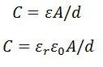 -----(1)

Where,  A – overlapping area of plates in m2 
d – the distance between two plates in meter 
ε – permittivity of the medium in F/m 
εr – relative permittivity 
ε0 – the permittivity of free space 

The schematic diagram of a parallel plate capacitive transducer is shown in the figure below. 

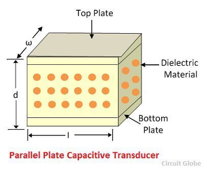
 
The change in capacitance occurs because of the physical variables like displacement, force, pressure, etc. The capacitance of the transducer also changes by the variation in their dielectric constant, which is usually because of the measurement of liquid or gas level.

The capacitance of the transducer is measured with the bridge circuit. The output impedance of transducer is given as

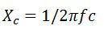 -----(2)

Where,   C – capacitance 
f – frequency of excitation in Hz. 

The capacitive transducer is mainly used for measurement of linear displacement. The capacitive transducer uses the following three effects.
1.	Variation in capacitance of the transducer is because of the overlapping of capacitor plates.
2.	The change in capacitance is because of the change in distances between the plates.
3.	The capacitance changes because of dielectric constant.
The following methods are used for the measuring displacement.

### 1.The transducer using the change in distance between the plates 

 The capacitance of the transducer is inversely proportional to the distance between the plates. The one plate of the transducer is fixed, and the other is movable. The displacement that is to be measured links to the movable plates.
 
 .png)

 
The capacitance is inversely proportional to the distance because of which the capacitor shows the nonlinear response. Such type of transducer is used for measuring the small displacement. The phasor diagram of the capacitor is shown in the figure below. 

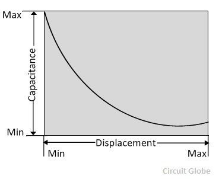

The sensitivity of the transducer is not constant and varies from place to place.

### 2. A transducer using the change in the area of plates 
The equation below shows that the capacitance is directly proportional to the area of the plates. The capacitance changes correspondingly with the change in the position of the plates.

.jpg)

The capacitive transducers are used for measuring the large displacement approximately from 1 mm to several cm. The area of the capacitive transducer changes linearly with the capacitance and the displacement. Initially, the nonlinearity occurs in the system because of the edges. Otherwise, it gives the linear response.
The capacitance of the parallel plates is given as 

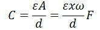 ------(3)
 
where,  x – the length of overlapping parts of plates 
ω – the width of overlapping parts of plates. 

The sensitivity of the displacement is constant, and therefore it gives the linear relation between the capacitance and displacement.
 
 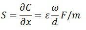 -----(4)
 
The capacitive transducer is used for measuring the angular displacement. It is measured by the movable plates shown below. One of the plates of the transducer is fixed, and the other is movable.

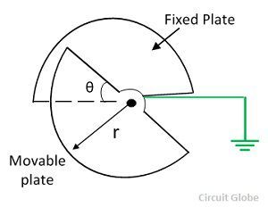

The variation of capacitance with angular displacement is linear as shown in the figure below.
 
 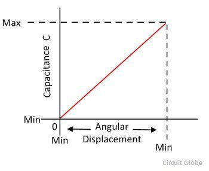

The angular movement changes the capacitance of the transducers. The capacitance between them is maximum when these plates overlap each other. The maximum value of capacitance is expressed as 

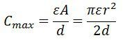 ------(5)
 
The capacitance at angle θ is given expressed as,
 
 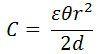 ------(6)
 
θ – angular displacement in radian. The sensitivity for the change in capacitance is given as 

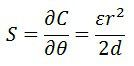 ------(7)
 
The 180° is the maximum value of the angular displacement of the capacitor.

#### Advantage of capacitive transducer
The following are the major advantages of capacitive transducers.

1.	It requires an external force for operation and hence very useful for small systems.
	
2.	The capacitive transducer is very sensitive.
	
3.	It gives good frequency response because of which it is used for the dynamic study.
	
4.	The transducer has high input impedance hence they have a small loading effect.
	
5.	It requires small output power for operation.

#### Disadvantages of capacitive transducer
The main disadvantages of the transducer are as follows.

1.	The metallic parts of the transducers require insulation.

2.	The frame of the capacitor requires earthing for reducing the effect of the stray magnetic field.

3.	Sometimes the transducer shows the nonlinear behaviors because of the edge effect which is controlled by using the guard ring.

4.	The cable connecting across the transducer causes an error.

#### Uses of Capacitive Transducer
The following are the uses of capacitive transducers.

1.	The capacitive transducer is used for measurement of both the linear and angular displacement. It is extremely sensitive and used for the measurement of very small distances.

2.	It is used for the measurement of the force and pressure. The force or pressure, which is to be measured, is first converted into a displacement, and then the displacement changes the capacitances of the transducer.

3.	It is used as a pressure transducer in some cases, where the dielectric constant of the transducer changes with the pressure.

4.	The humidity in gases is measured through the capacitive transducer.

5.	The transducer uses the mechanical modifier for measuring the volume, density, weight etc.